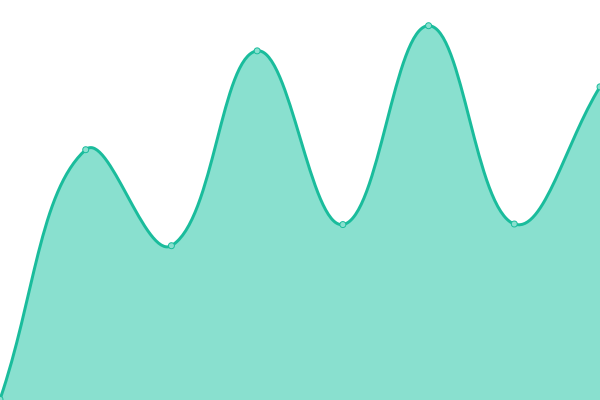

# [📈 Live Status](https://rodrigomorales77.github.io/aion): <!--live status--> **🟩 All systems operational**

This repository contains the open-source uptime monitor and status page for [rodrigomorales77](https://rodrigomorales77.github.io/aion), powered by [Upptime](https://github.com/upptime/upptime).

With [Upptime](https://upptime.js.org), you can get your own unlimited and free uptime monitor and status page, powered entirely by a GitHub repository. We use [Issues](https://github.com/rodrigomorales77/aion/issues) as incident reports, [Actions](https://github.com/rodrigomorales77/aion/actions) as uptime monitors, and [Pages](https://rodrigomorales77.github.io/aion) for the status page.

<!--start: status pages-->
<!-- This summary is generated by Upptime (https://github.com/upptime/upptime) -->
<!-- Do not edit this manually, your changes will be overwritten -->
<!-- prettier-ignore -->
| URL | Status | History | Response Time | Uptime |
| --- | ------ | ------- | ------------- | ------ |
|  [AION](https://aion.com.ar) | 🟩 Up | [aion.yml](https://github.com/rodrigomorales77/aion/commits/HEAD/history/aion.yml) | 

 453ms
     
 | 

<a href="https://rodrigomorales77.github.io/aion/history/aion">100.00%</a>
    

|  [CESPAL](https://cespal.aion.com.ar) | 🟩 Up | [cespal.yml](https://github.com/rodrigomorales77/aion/commits/HEAD/history/cespal.yml) | 

 1687ms
     
 | 

<a href="https://rodrigomorales77.github.io/aion/history/cespal">99.77%</a>
    

|  [RUFINO](https://rufino.aion.com.ar) | 🟩 Up | [rufino.yml](https://github.com/rodrigomorales77/aion/commits/HEAD/history/rufino.yml) | 

 1774ms
     
 | 

<a href="https://rodrigomorales77.github.io/aion/history/rufino">100.00%</a>
    

<!--end: status pages-->

[**Visit our status website →**](https://rodrigomorales77.github.io/aion)

## 📄 License

- Powered by: [Upptime](https://github.com/upptime/upptime)
- Code: [MIT](./LICENSE) © [rodrigomorales77](https://rodrigomorales77.github.io/aion)
- Data in the `./history` directory: [Open Database License](https://opendatacommons.org/licenses/odbl/1-0/)
